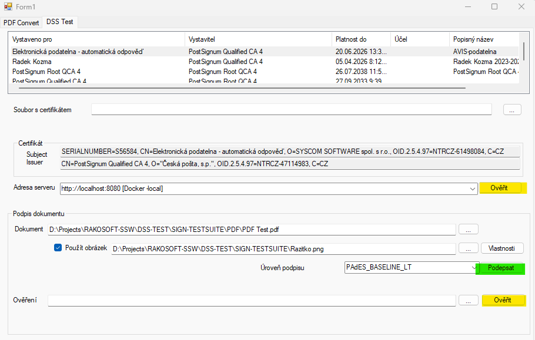

## Konfigurace projektu DSS

Projekt DSS ( https://ec.europa.eu/digital-building-blocks/wikis/display/DIGITAL/eSignature ) pro použití v prostředí Syscom softwware 


# Změny oproti původní verzi projektu


* Z dockerfile byly odstraněny všechny konfigurace kromě dss-demo-webapp. 
* Do Dockerfile byla přidána instalace kořenových certifikátů Postsignum
* Odkazy z aplikace na dokumentaci jsou přesměrovány na [originální projekt](https://ec.europa.eu/digital-building-blocks/DSS/webapp-demo/) 
* Nová třída cz.ssw.dss.SswTspSource (extends OnlineTSPSource)
  * byly přidány dva konstruktory pro konfiguraci přístupu k TSP serverům POSTSIGNUM
  * použití-viz. "/src/main/resources/config/tsp-config.xml"

## Soubor konfigurace "tsp-config.xml"

#### Pro přihlášení uživatelským jménem a heslem

> __POZOR__ - adresu serveru (tspServer) je třeba zadat  **VČETNĚ KONCOVÉHO LOMÍTKA !**. Pokud tam není, dochází k cyklickému přesměrování - CIRCULAR REDIRECT

```xml
<bean id="tspSource" class="cz.ssw.dss.SswTspSource">
    <constructor-arg name="tspServer"  value="https://tsa.postsignum.cz:444/TSS/HttpTspServer/" />
    <constructor-arg name="username"  value="......." />
    <constructor-arg name="password"  value="......." />
</bean>
```

#### Přihlášení certifikátem
Je možné použít libovolný komerční certifikát vydaný Postsignum.cz svázaný s účtem pro odběr časových razítek

Klíč (certifikát) musí být uložen v *keystore* 

Pro vytvoření keystore lze použít [KeyStore Explorer](https://keystore-explorer.org/)

Výsledný soubor musí být v adresáři */src/main/resources/*

Konfigurace v souboru *tsp-config.xml* :

```xml
<bean id="tspSource" class="cz.ssw.dss.SswTspSource">
	<constructor-arg name="tspServer"  value="https://tsa.postsignum.cz/TSS/HttpTspServer/" />
	<constructor-arg name="sslKeystoreType"  value="PKCS12" />
	<constructor-arg name="sslKeystoreResource"  value="postsignum_client.p12" />
	<constructor-arg name="sslKeystorePassword"  value="AVISME" />
	<constructor-arg name="useKeyAsTrustMaterial"  value="false" />
</bean>
```


## Ostatní změny a co dál
Je třeba vyzkoušet

* Možnostit zabezpečení
  * API Key - viz. [Securing Spring Boot API With API Key and Secret](https://www.baeldung.com/spring-boot-api-key-secret)
  * IP filter - viz. [Stackoverflow](https://stackoverflow.com/questions/37337745/springmvc-how-to-filter-the-clients-ip) resp. [Spring Security – Whitelist IP](https://www.baeldung.com/spring-security-whitelist-ip-range)
* Lokalizace aplikace (je to nutné ?)
* Lokalizace resources z DSS - výsledky validací etc.
* Změny v policy souborech - otázka je jesstli tady. Při validaci se soubor s policy nechá poslat jako parametr. Možná by to bylo lepší. Na druhou stranu je otázka, jestli je žádoucí aby si klient určoval validační pravidla.

# Spuštění v prostředí Dockeru

## Vytvoření docker image

V adresáři se souborem *dockerfile* spustit
```cmd
docker build -t dss-ssw .
```

## Spuštění serveru

```cmd
 docker run --name SSW-DSS-SERVER  --publish 8080:8080 dss-ssw
```

nebo v *detached* módu

```cmd
 docker run -d -p 8080:8080 dss-ssw
```

## Test api přístupu

Pro testování přístupu k serveru je možní použít testovací aplikaci [SSW.Pdf.Test](https://github.com/sswdevops/PdfTools/tree/master/SSW.Pdf.Test) z projektu [PdfTools](https://github.com/sswdevops/PdfTools).

Aktuálně je možné testovat podpisy různých souborů (PDF, JSON, XML) . Žlutě podbarvená tlačítka (ověření certifikátu, ověření podpisu v dokumentu) jsou funkční, chybí zpracování výstupu. Jediná možnost jak "chytit výstup" je v debuggeru. (*Je třeba vyjasnit, co má být výstupem validace. Zejména s ohledem na AVIS. Výsledný JSON z validace je standardně dost objemný*)

Pro ověření je nyní lepší použít webové rozhraní serveru "http://localhost:8080/validation"

Pro podpis dokumentu je určeno zeleně podbarvené tlačítko. Pozor na nastavení formátu podpisu (na obrázku je špatně "Úroveň podpisu")




